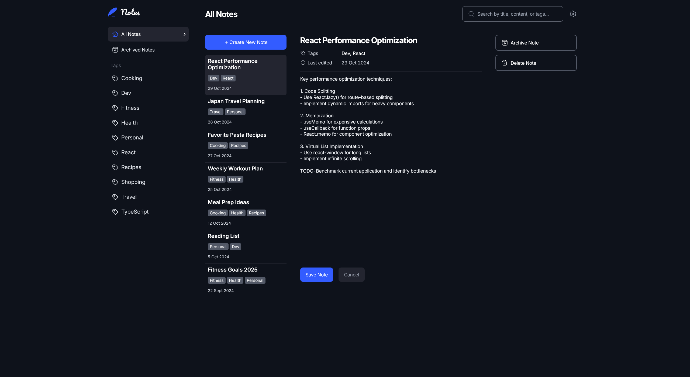
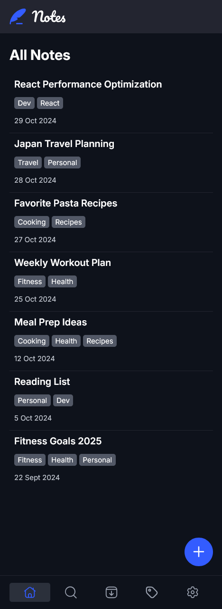

# Frontend Mentor - Note-taking web app solution

This is a solution to the [Note-taking web app challenge on Frontend Mentor](https://www.frontendmentor.io/challenges/note-taking-web-app-773r7bUfOG). Frontend Mentor challenges help you improve your coding skills by building realistic projects.

## Table of contents

- [Overview](#overview)
  - [The challenge](#the-challenge)
  - [Screenshot](#screenshot)
  - [Links](#links)
- [My process](#my-process)
  - [Built with](#built-with)
  - [What I learned](#what-i-learned)
  - [Continued development](#continued-development)
  - [Useful resources](#useful-resources)
- [Author](#author)
- [Acknowledgments](#acknowledgments)

## Overview

### The challenge

Users should be able to:

- Create, read, update, and delete notes
- Archive notes
- View all their notes
- View all archived notes
- View notes with specific tags
- Search notes by title, tag, and content
- Select their color theme
- Select their font theme
- Receive validation messages if required form fields aren't completed
- Navigate the whole app and perform all actions using only their keyboard
- View the optimal layout for the interface depending on their device's screen size
- See hover and focus states for all interactive elements on the page
- **Bonus**: Save details to a database (build the project as a full-stack app)
- **Bonus**: Create an account, log in, change password (add user authentication to the full-stack app)
- **Bonus**: Reset their password (add password reset to the full-stack app)

### Screenshot

### Links

- Solution URL: [Add solution URL here](https://your-solution-url.com)
- Live Site URL: [Live Site Url](https://note-taking-app-two-rust.vercel.app)

## My process

### Built with

- Semantic HTML5 markup
- CSS custom properties
- Flexbox
- CSS Grid
- Mobile-first workflow
- [React](https://reactjs.org/) - JS library

### What I learned

This is my first React app which involve many features at one place and i have learned many things from it.

Some of the major learning are:

- I have learned how i can structure my react router for multiple column layout
- I have learned how i can implement CRUD operation in React.
- I have learned how i can make my application accessible to the screen reader and keyboard users
- I have learned how i can test my app to make sure it is really navigatable through keyboard and screenreader users.
- I have learned how i can make my app responsive to any screen size and to a browser font size change.
- I have learned how i can structure my folders inside the src folder.
- I have learned how i can create modal and toast components.
- i have learned how i can implement form validation in react and so many other things.

### Continued development

For the future i will continue my react course which i am following and try to do projects which are more difficult than this and more challenging that can allow me to implement the things which i have learned from the react course.

### Useful resources

I have used youtube videoes to help me see how i can use css variables to implement dark and light mode features in react.

## Author

- Frontend Mentor - [@aemrobe](https://www.frontendmentor.io/profile/aemrobe)
- Twitter - [@Aemro112](https://www.twitter.com/Aemro112)

## Acknowledgments

I want to say huge thanks to Grace snow(a mentor from frontendmentor.io) who has helped me how i can make my application more accessible and responsive. I also want to say huge thanks to zeynab my developer freind who has suggested me to change many things in my app like changing my single toast system to multiple toast system and many other helpful things.
